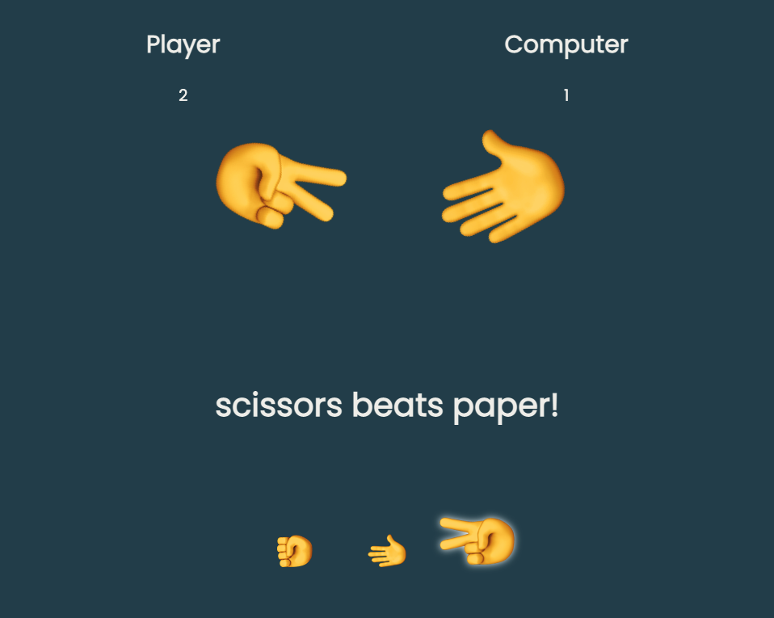

# "Rock, Paper, Scissors" game
Animated Rock, Paper, Scissors game
assignment from [The Odin Project](https://www.theodinproject.com/paths/foundations/courses/foundations/lessons/rock-paper-scissors)

## Technologies/Tools
Project is created with:
* Visual Studio Code
* HTML
* CSS
* Vanilla JavaScript

## Summary
What I learned:
* Adding/Removing classes on HTML elements through JS
* Git features 
* Game functions that change page content 
